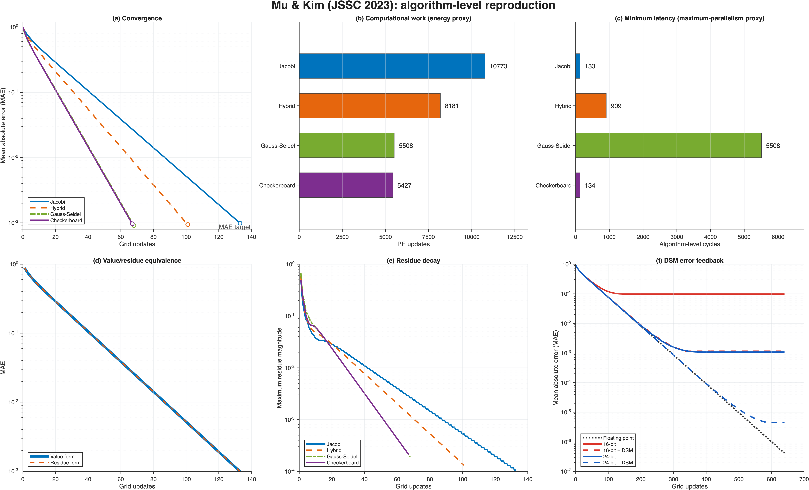
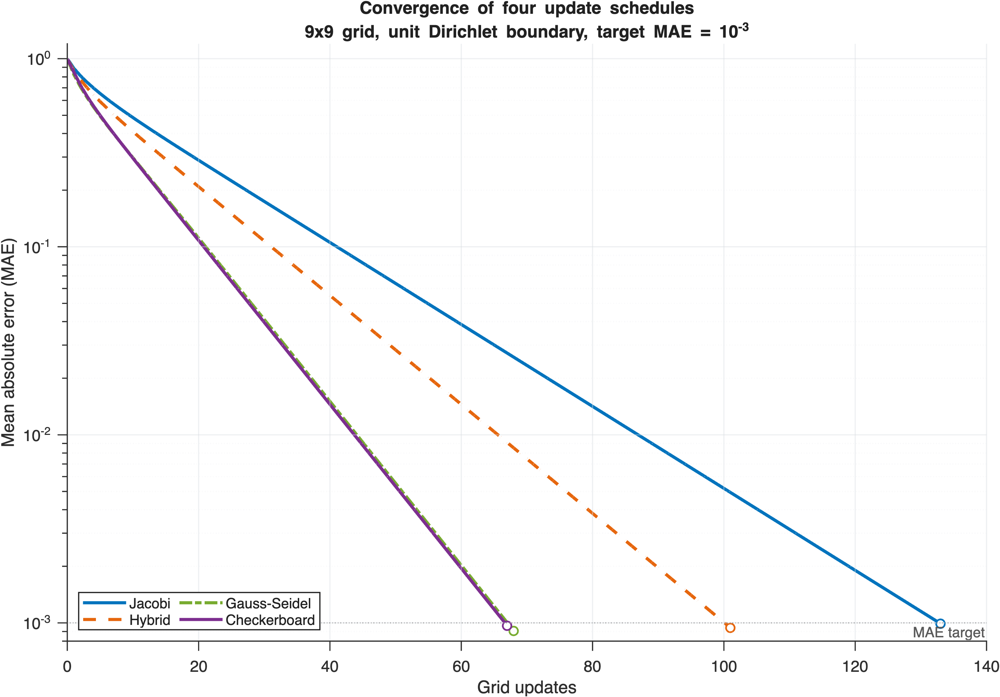
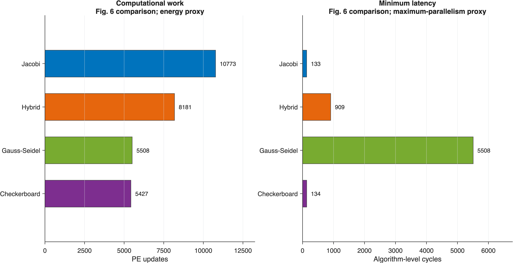
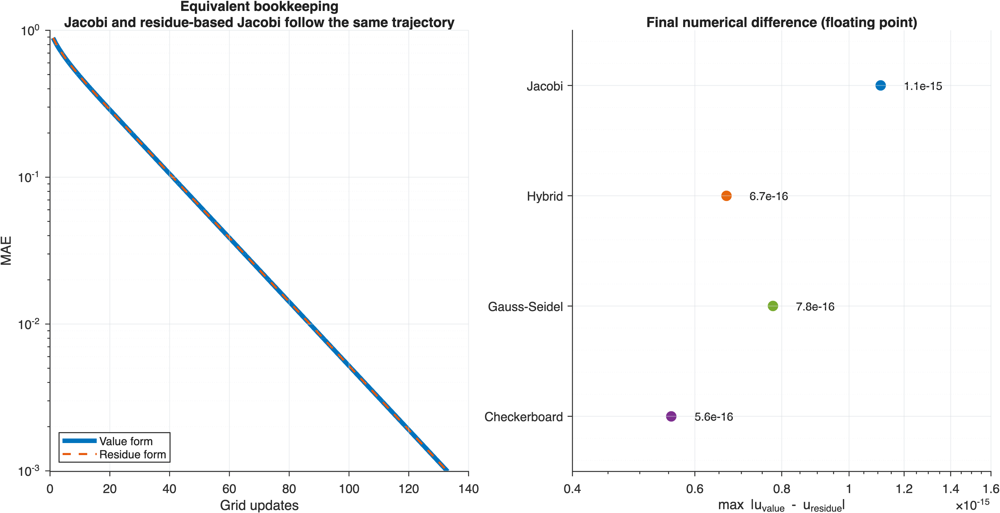
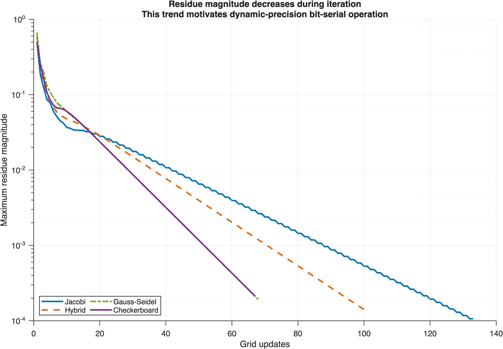
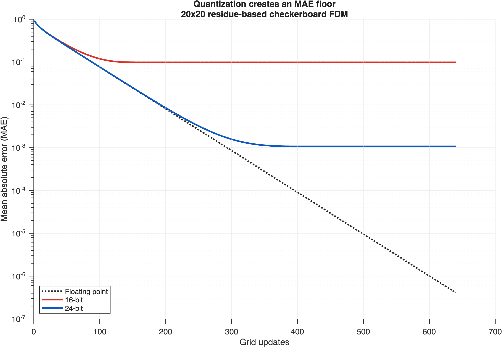
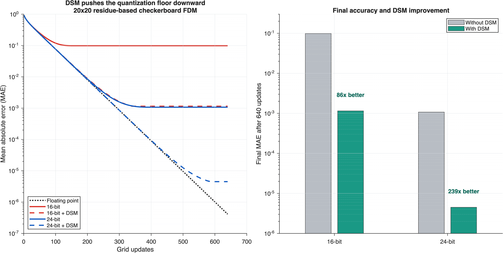

# Mu & Kim 2023 MATLAB 复现

这个目录复现三组算法级结果：四种更新方法、residue-based FDM，以及固定精度下加入/不加入 DSM 的对比。

## 怎么运行

在 MATLAB 中运行：

```matlab
run('run_all.m')
```

脚本会计算一次全部实验，在命令行输出数值，并将 300 dpi 图片写入 `figs/`。如果只想看某一部分，可以运行：

- `benchmarking.m`：四种方法的收敛曲线；
- `benchmarking_fig6.m`：PE 更新次数和周期代理；
- `benchmarking_residue.m`：值迭代/residue 等价性和 residue 衰减；
- `benchmarking_quant.m`：不含 DSM 的量化误差地板；
- `benchmarking_dsm.m`：加入/不加入 DSM 的完整对比；
- `summary_onepage.m`：只生成六面板汇总图。

## 代码结构

- `func/mu_kim_config.m`：所有网格、阈值、位宽和方法配置；
- `func/run_mu_kim_experiments.m`：只负责数值计算；
- `func/print_mu_kim_results.m`：只负责命令行结果；
- `func/plot_mu_kim_results.m`：统一负责配色、布局和图片导出；
- `func/*_step.m`：各更新方法的一步运算。

## 结果图

六面板汇总图集中展示四种方法的收敛速度、计算开销、residue 等价性与 DSM 改善效果。



Fig. 1 表明 Checkerboard 和 Gauss–Seidel 收敛最快，分别在 67 轮和 68 轮达到 `MAE <= 1e-3`。



Fig. 2 对比四种方法的 PE 更新次数和最小周期代理，Checkerboard 在保持较低计算量的同时具有最短并行延迟。



Fig. 3 显示值迭代与 residue 迭代的收敛轨迹重合，最终数值差异仅为 `1e-15` 量级。



Fig. 4 展示 residue 随迭代不断减小，这也是动态降低位宽能够节省位串行周期的依据。



Fig. 5a 表明不加入 DSM 时，定点 residue 的截断误差会形成明显的 MAE 平台。



Fig. 5 对比加入和不加入 DSM 的结果，16-bit 和 24-bit 的最终 MAE 分别改善 85.5 倍和 238.6 倍。



图 2 中的 PE updates 和 cycles 是与论文 Fig. 6 对应的算法级代理量，不是芯片实测能量和延迟。`explore/` 中的双上下文和 SOR 也只是探索模型，硬件代价需另行评估。
